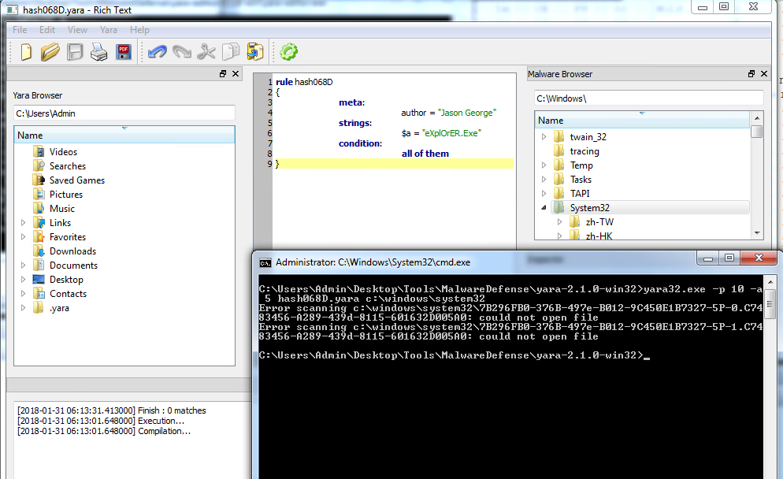
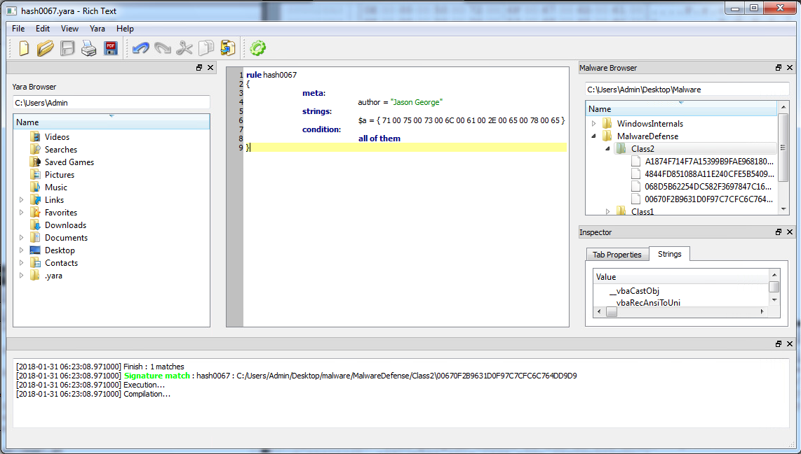

[Back to Index](https://jaegermeiste.github.io/DefenseAgainstTheDarkArts/)

## Week 3 Writeup

Jason George

### Malware Defenses Lesson 1 - Wk 3

Craig Schmugar [@craigschmugar](https://twitter.com/craigschmugar) is currently a Principal Engineer at McAfee, and has been employed there in one capacity or another since 2000.

The phases of the malware infection/exploitation attack graph are useful because it enables both a conversation targeting specific portions of the attack, but also because it conceptually lends itself to defense in depth. Naturally there are a myriad of attack vectors, almost all of which exploit people's trust or ignorance in order to obtain credentials or remotely execute code on a target system in order to establish a beachhead. The beachhead is what was explored in some depth during the last Lab. That is follwed by various malicious actvities, which (objectively) are some of the least interesting parts - because at this point (generally), the malicious actors' objective has been obtained.

More of a deeper dive into Yara [https://virustotal.github.io/yara/](https://virustotal.github.io/yara/) plugins this week - the string pattern matching is an interesting strategy to identify related malware (or related programs, period). Leveraging FileInsight to obtain an intial set of strings to exploit (based on a known piece of malware) makes a lot of sense, especially given the common inheritance of many malware kits.

### Malware Defenses Lesson 2 - Wk 3

It is interesting to see that unique malware formas are growing exponentially - my instanct would have been that unique forms would actually decrease somewhat, given the prevalance of script kiddies and premade malware toolkits for sale on the dark web. I suppose that is partially dependent on the semantic definition of unique, though.

Cuckoo Sandbox [https://www.cuckoosandbox.org/](https://www.cuckoosandbox.org/) is an interesting tool, but it seems like it may duplicate a lot of functionality found in the other analysis tools.

Using Yara in practice for this lab has been a nightmare. It complained of syntax errors and unterminated strings that were not there (the rules aren't complex). The Yara editor (or at least the old version on the VM) was not very useful as an IDE. Not expecting Visual Studio, but still... The Rules Generator hung every time, complaining that the window did not have a \[\*\] in the title:

Running Yara itself, it just complained about being unable to open files in the system32 directory and gave no useful results.

This is apparently normal, per the video, but frustrating.

Below is the "Blog Post" based on the samples in MalwareDefense/Class2:

The first step for this analysis was examining the strings with FileInsight.

- For hash 068D...10B7, a major flag that this is malware are misspelled strings like 'eXplOrER.Exe'.
- For hash 0067...D9D9, it apparently opens a bunch of Internet Explorer windows for several (presumably) malicious sites. It also contains the string 'attrib +r +s +h c:\qusla.exe >nul', which is setting an executable to read only and hidden, whihc is highly suspicious.
- For hash 4884...6209, it is apparently LADS [https://www.securityfocus.com/tools/1251](https://www.securityfocus.com/tools/1251) and [http://www.heysoft.de/](http://www.heysoft.de/), which is an obsolete sysadmin tool.
- For hash A187...B303, the file is apparently an executable, but it is unclear what it does (though it was compiled in Borland Delphi like LADS above).

Then, building Yara scripts for the two bad programs:
- For hash 068D...10B7, it was as simple as searching for the 'eXplOrER.Exe' string. No false positives were found in C:\Windows\System32.

  

- For hash 0067...D9D9, there were no hits for 'attrib +r +s +h c:\\qusla.exe >nul' or even just 'qusla.exe'. This required a search for the hex version of 'qusla.exe' as seen below. No false positives found in C:\Windows\System32 either.

  
