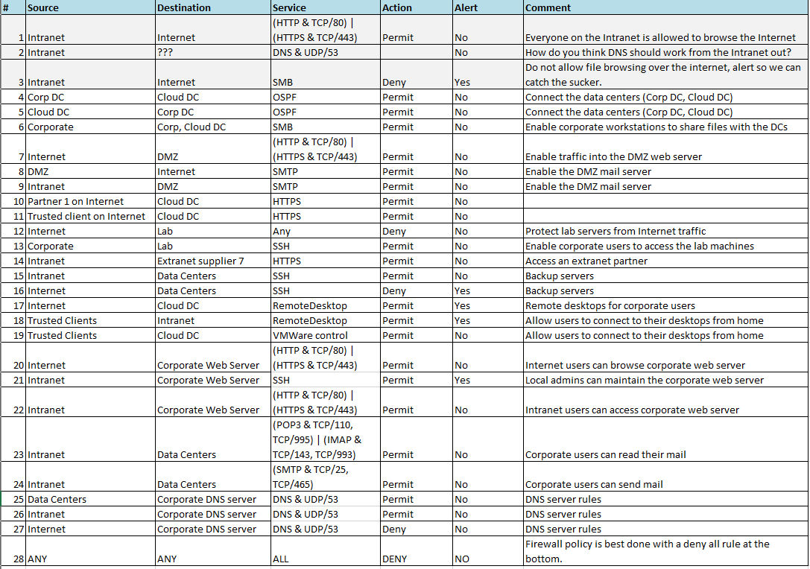
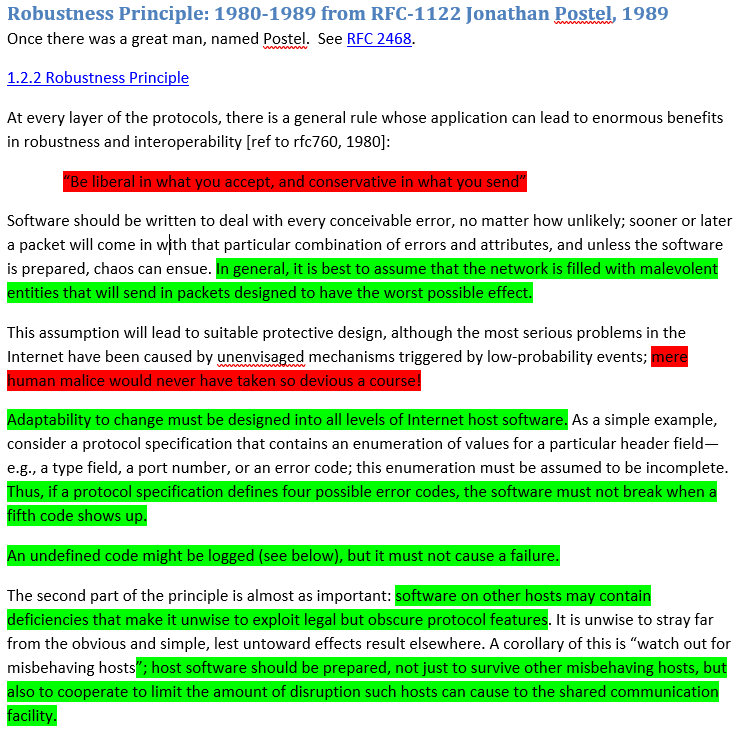

[Back to Index](https://jaegermeiste.github.io/DefenseAgainstTheDarkArts/)

## Week 6 Writeup

Jason George

### Network Security Lesson 1 - Wk 6

Ram Venugopalan ([linkedin.com/in/kapooraditya](linkedin.com/in/kapooraditya)) is currently Director of Security Architecture at Cylance, but was a Research Architect at Intel Security at the time of the video. Cylance [https://www.cylance.com/en_us/home.html](https://www.cylance.com/en_us/home.html) is an AntiVirus vendor with an emphasis on Artifical Intelligence; however, the web site is marketing heavy and information light, so it is unclear what, exactly, the emphasis on AI actually means.

#### Firewall HW

### Network Security Lesson 2 - Wk 6

#### Robustness HW

1. I would suggest being conservative in what you accept, rejecting the rest, and also being conservative in what you send.
2. It is definitely best to assume that pretty much everything is trying to break your system.
3. Human malice has certainly gone farther than disrupting networks.
4. Token ring vampire taps and NetBIOS, anyone? I'd rather some TCP/IP over 40 GbE...
5. This is just good programming practice.
6. This is also just good programming practice.
7. This is interesting in the context of rootkits and antivirus software, but in general, your application should not mess with the undocumented API (or the deprecated/obscure stuff that nobody uses).
8. This is similar to the FCC requirement that electronics must happily accept interference while also not generating any. Makes sense in both contexts.
