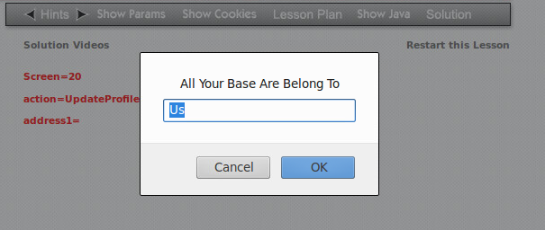
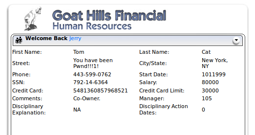
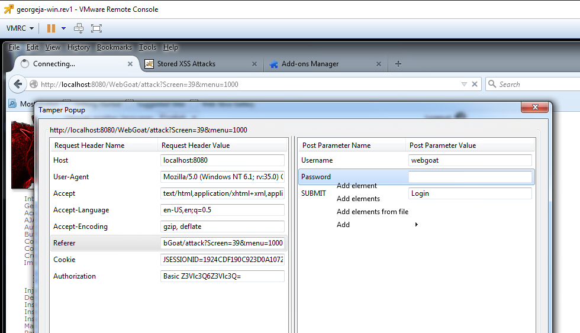
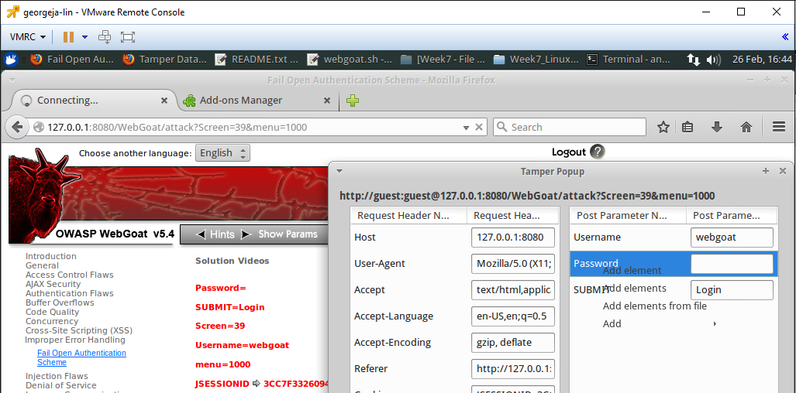
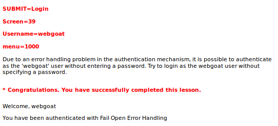
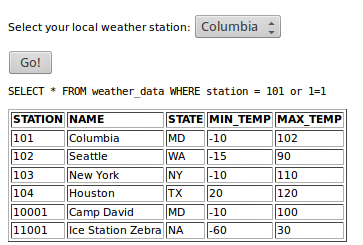

[Back to Index](https://jaegermeiste.github.io/DefenseAgainstTheDarkArts/)

## Week 7 Writeup

Jason George

### Web Security Lesson 1 - Wk 7

Cedric Cochin  ([https://www.linkedin.com/in/cochin/](https://www.linkedin.com/in/cochin/)) is currently a Senior Research Architect at McAfee, and recently authored an article ([https://securingtomorrow.mcafee.com/business/update-technical-mcafee-detail-doubleagent/](https://securingtomorrow.mcafee.com/business/update-technical-mcafee-detail-doubleagent/))regarding the DoubleAgent malware that hijacked antivirus software using Windows Debugging layer (something alluded to in the Windows Internals lectures).

Seeing NCSA Moscia was a throwback - I recall the SPRY branded variant as the first web browser I ever used.

The "Web Browser 1.0" and "Web Browser 2.0" slides, in comparison to one another, are quite possibly the clearest diagram of the evolution of the Web (under the hood) that I think I have ever seen, and whether intended ot or not, show how JavaScript (or ECMAScript, if you really want to be pedantic) has become such a lethal attack vector.

Fake updates and Fake AV are listed as common attack vectors, but I think Fake Tools (partition tools, data recovery tools, video conversion) is also a strong one - where the first two categories are likely to burn the Average Joe, fake utilities might burn the more savvy user. Even CCleaner had malware not all that long ago ([https://www.pcworld.com/article/3225407/security/ccleaner-downloads-infected-malware.html](https://www.pcworld.com/article/3225407/security/ccleaner-downloads-infected-malware.html)), and Daemon Tools, once venerable and absolutely essential for anyone who was an administrator, has itself been riddled with malware for years. The problem ultimately becomes that all 3rd Party applications with system-level access are a major risk, and if you don't know any better, can you trust MalwareBytes? Avast? Some of the junk looks almost as good as what's legitimate...

"Robin Sage" ([https://en.wikipedia.org/wiki/Robin_Sage](https://en.wikipedia.org/wiki/Robin_Sage), [http://media.blackhat.com/bh-us-10/whitepapers/Ryan/BlackHat-USA-2010-Ryan-Getting-In-Bed-With-Robin-Sage-v1.0.pdf](http://media.blackhat.com/bh-us-10/whitepapers/Ryan/BlackHat-USA-2010-Ryan-Getting-In-Bed-With-Robin-Sage-v1.0.pdf)) was a white hat experiment created by Thomas Ryan effectively examining how much people trusted someone based solely on their social media presence. While borderline identity theft, it was surprisingly (and scarily effective):
<iframe width="560" height="315" src="https://www.youtube.com/embed/4pnKbibi6QY" frameborder="0" allow="autoplay; encrypted-media" allowfullscreen></iframe>

Search Result Annotation and Site Reputation Services should be a core feature of a search engine at this point, and not require a browser plugin (or, of all evil things, a toolbar). Unfortunately neither Google nor Bing appears to have the functionality at the moment - but there isn't a good reason why they shouldn't - or perhaps make it an opt-in feature if they're worried about getting sued somehow.

Some thoughts on attack vectors:
-Because of the work of the past several weeks, it is now significantly clearer to me how a browser might execute shellcode via JavaScript.
-Man in the Middle is somewhat self-explanatory.
-Same with DNS Spoofing.
-Clickjacking is very interesting. For sites that still use Flash for some reason (ProctorU I'm looking at you [https://test-it-out.proctoru.com/](https://test-it-out.proctoru.com/)), it's unclear whether you can ever trust the Flash rights popup anyway, but reskinning it with an ad is both brilliant and terrifying.
-Avoiding SQL Injection was touched on in the Web and Databases courses, and hopefully any modern web apps are hardened to prevent it. Then again, there are plenty of second and third tier banks who have probably never even heard of it... the same sorts of places that store cleartext unsalted passwords...
-Same origin breaking HTTPS is possibly one of the most annoying "features" ever - CORS only fixes some of that.
-I never realized how simplistic Cross Site Scripting (XSS) really was.
-The attack surface becvause of the large feature set of HTML5 makes sense, but at the same time those features are largely needed - I imagine HTML6 (someday) will mostly focus on plugging the security holes found in v5.

#### WebGoat - Lab 1
1. Cross Site Scripting - this one was easy. Dump ```<script>prompt("All Your Base Are Belong To","Us");document.write("You have been Pwnd!!!1!";</script>``` into the Street field (which incidentally pwns both Tom and Jerry, not just Jerry).


2. For the Fail Open Authentication, the Tamper Data Tool does not let you delete the value, so it is (nearly) impossible to complete the lab on either Windows or Linux. The tool, on both systems, only shows the first 4 of a whole list of options:


For whit it's worth, tt took way longer than it should have to find how to actually run the Tamper Data plugin. A few improvements to the lab (like a single line about it showing up under the Tools Menu, press ALT) would go a LONG way to making this significantly more focused on the topic. Then, after wasting a ton of time trying to figure it out, the tool doesn't even work properly (at first).
The trick is to hit the add element option, which generates an error. Then, after that, the context menu finally shows the delete option and it is possible to complete the lab.

3. SQL Injection - surprisingly simple to trigger the full table dump:


### Web Security Lesson 2 - Wk 7

Much of the early part of this lecture is a common overview of web tools (WHOIS, etc) and security related websites. CheckShortURL [https://checkshorturl.com/](https://checkshorturl.com/) may well be the most useful every day.

The client side tools are more interesting, especially Burp Suite and Web Scarab (referenced in the WebGoat lab). Firebug seems like it replicates functionality that already exists in the Developer tools in Firefox, Chrome, and Edge.

The remainder of this lecture is covered by Lab 2, submitted seperately on Canvas.
