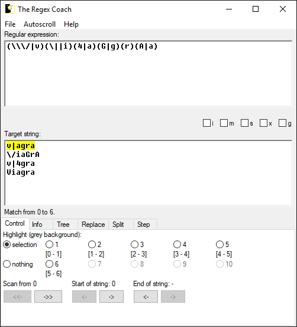

[Back to Index](https://jaegermeiste.github.io/DefenseAgainstTheDarkArts/)

## Week 8 Writeup

Jason George

### Messaging Security Lesson 1 - Wk 8

Eric Peterson ([https://www.linkedin.com/in/eric-peterson-b3500256/](https://www.linkedin.com/in/eric-peterson-b3500256/)) is currently Director of Threat Research at McAfee, but at the time of the lectures was simply the Research Manager for Email Security.

Bayesian statistical anylysis of data is something I have done extensively - my undergraduate thesis was a Bayesian analysis of terrorist sentiment differentiating Al-Qaeda affiliates from one another (a major win in that analysis was that Al Qaeda in Iraq stood out significantly, about 6 months prior to them formally fragmenting off into ISIL). The unique feature of that analysis is that the strings were rated among various psycholinguisitc dimensions by human raters - that is, the corpus analysis was done by people, not machine (which (at the time) couldn't identify sentiment or sarcasm, etc) - but it is cool to find common ground between two wildly different academic domains.

Regex Coach [http://weitz.de/regex-coach/](http://weitz.de/regex-coach/) is a cool tool, and I wish I had known about it years ago. Like most people, Iam not a regex ninja, and this tool makes it very clear what the regex catches. The only feature that seems to be missing is treating CRLF as a new string (so you can see which strings you are hitting simultantouesly / multiple strings in the box). It doesn't appear to be open source, and apparently hasn't had an update since 2008, so eventually the program will likely end up dying, sadly.


The Regex itself (as above) wasn't too complicated for the limited case of
```
v | a g r a
\/iaGrA
v|4gra
!Viagra
```
but clearly this expression was written specifically for the dataset and would probably miss most other variant "spellings" of the word. 

Lab 1:

How many total:

-Records: 
```sql
SELECT count(*) AS record_count FROM message_data;
```
100000

-Source_Ips:
```sql
SELECT count(*) AS ip_count FROM message_data WHERE source_ip IS NOT NULL;
```
99986

-Subjects: 
```sql
SELECT count(*) AS subj_count FROM message_data WHERE msubject IS NOT NULL;
```
100000

-Attachments: 
```sql
SELECT count(*) AS atch_count FROM message_data WHERE attachment_name IS NOT NULL AND length(attachment_name) > 0;
```
99244

-Urls: 
```sql
SELECT count(*) AS url_count FROM message_data WHERE url IS NOT NULL;
``` 
96877

How many distinct:

-Source_Ips: 
```sql
SELECT count(distinct(source_ip)) FROM message_data;
```
25745

-From Domains: 
```sql
SELECT count(distinct(helo_domain)) FROM message_data;
```
22994

-Subjects: 
```sql
SELECT count(distinct(msubject)) FROM message_data;
```
16636

-Attachments: 
```sql
SELECT count(distinct(attachment_name)) FROM message_data;
```
76745

-URLs: 
```sql
SELECT count(distinct(url)) FROM message_data;
```
88146

What is the average:

-Message size: 
```sql
SELECT avg(message_size) FROM message_data;
```
187560.16272

-Subject length: 
```sql
SELECT avg(length(msubject)) FROM message_data;
```
27.70129

How many:

-.zip: 
```sql
SELECT count(*) FROM message_data WHERE lower(right(attachment_name, 4)) = '.zip';
```
150

-.rar: 
```sql
SELECT count(*) FROM message_data WHERE lower(right(attachment_name, 4)) = '.rar';
```
6

-.xlsx: 
```sql
SELECT count(*) FROM message_data WHERE lower(right(attachment_name, 5)) = '.xlsx';
```
530

-.docx: 
```sql
SELECT count(*) FROM message_data WHERE lower(right(attachment_name, 5)) = '.docx';
```
653

-.pdf: 
```sql
SELECT count(*) FROM message_data WHERE lower(right(attachment_name, 4)) = '.pdf';
```
5410

-.exe: 
```sql
SELECT count(*) FROM message_data WHERE lower(right(attachment_name, 4)) = '.zip';
```
1

What is the most common:

-File extension in urls?: 
```sql
SELECT lower(right(url, position('.' in reverse(url))-1)) as extension, count(*) as count FROM message_data GROUP BY extension ORDER BY count DESC;
```
.com is the most common extension.


### Messaging Security Lesson 2 - Wk 8

As of this writing, the Kindle Edition of O'Reilly's *Data Driven* ([https://www.amazon.com/Data-Driven-DJ-Patil-ebook/dp/B00SXHFTAS](https://www.amazon.com/Data-Driven-DJ-Patil-ebook/dp/B00SXHFTAS), *_NOT_* an affiliate link) by DJ Patil and Hilary Mason is FREE on Amazon.

My Master's degree is in Forensic Psychology, and despite what Television says, Criminal Profiling is fundamentally Data Science. The big hurdle in that domain is qunatifying data (e.g. "How do you quantify an aggressive stab wound as opposed to a hesitant stab wound?"), but once you have a messy crime scene represented as a dataset, you are effectively seeking patterns and extrapolating and qualifying data - only instead of detecting spam, you are detecting whether or not a scene matches a serial killer's signature (signature in this sense being the same as for spam or viruses, not the criminological definition). Another cool convergence of skills I learned in a completely different academic domain.
