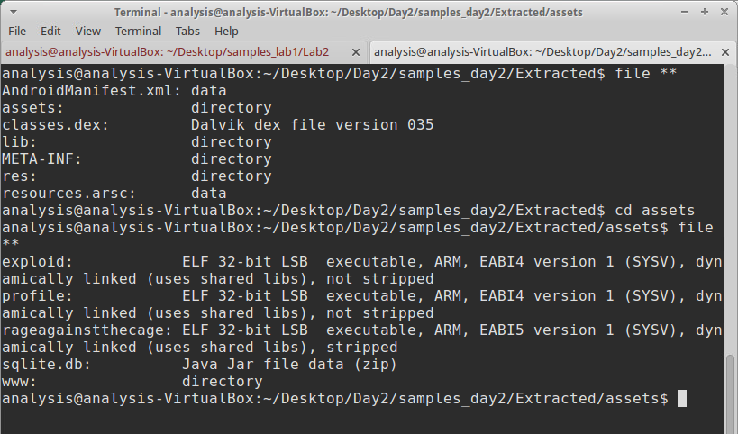
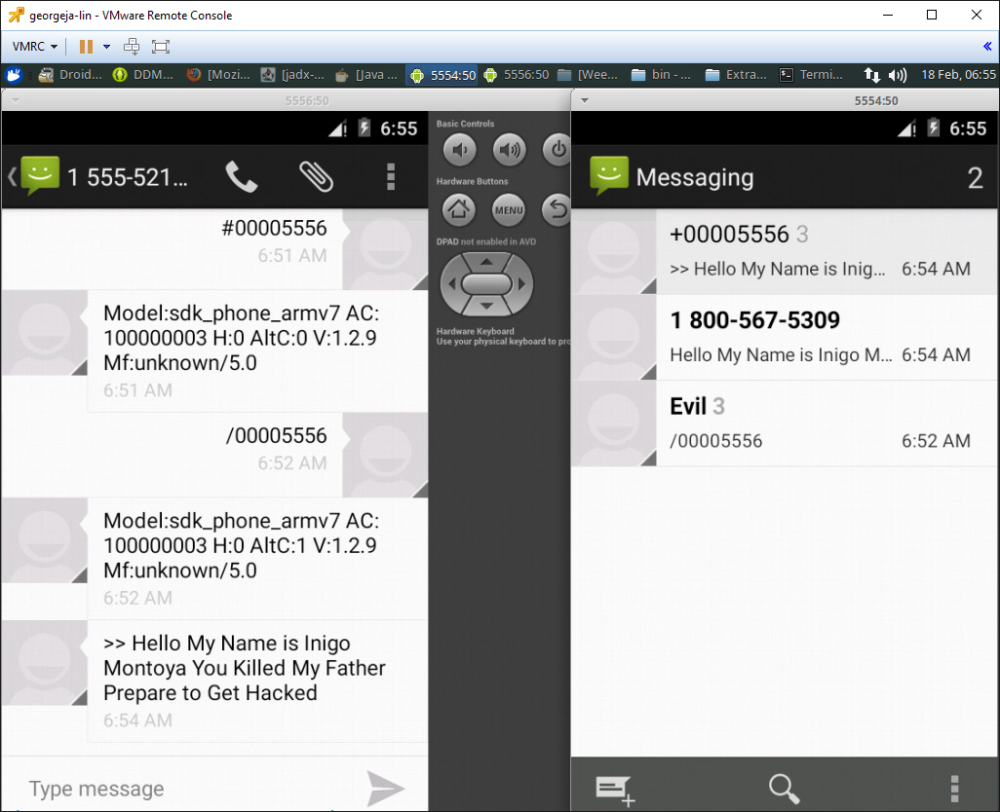

[Back to Index](https://jaegermeiste.github.io/DefenseAgainstTheDarkArts/)

## Week9/10 Writeup

Jason George

### Mobile Security Lesson 1 - Wk 9

Alex Hinchliffe ([https://www.linkedin.com/in/alexanderhinchliffe/](https://www.linkedin.com/in/alexanderhinchliffe/)) is a Threat Intelligence Analyst at Palo Alto Networks, but was formerly a Mobile Malware Research Manager with McAfee/Intel Security. Fernando Ruiz ([https://securingtomorrow.mcafee.com/author/fernando-ruiz/](https://securingtomorrow.mcafee.com/author/fernando-ruiz/)) is a security researcher at McAfee.

This is a nice walkthrough through the history of modern mobile devices and the history of malicious attacks against early mobile devices (of which I was mostly completely unaware). The lecture is showing its age more than any other in the course (Windows Mobile still going strong!), but the information is pertinent and despite the apparent age, was highly informative.

In terms of Android architecture, I probably got more out of this lecture than I had from several years of tinkering with Android. The Android developer documentaiton can be through but dense, and as Intents were presented in this lecture, I thought that it might well be the most clear and concise explanation of what they were that I have ever heard.

Having owned an Android phone since the Droid era, I am very familiar with rooting and deodexing, but the mechanisms used to actually acquire root and the structure of an APK were vague to me until this presentation (as above). Another strong impression.

It is particularly interesting how malicious actors exploited Google's attempts to combat them, turning the Market Security app against Google.

#### Lab 1: FakePlayer
##### APK File is a zip file:

##### Decompile:

##### Reverse:

##### Results:
- FakePlayer sends 3 SMS messages.
- FakePlayer sends the message "798657" to shortcodes 3353 and 3354.
- FakePlayer uses the onCreate callback of the Activity to execute the payload.

#### Lab 2: Walk&Text

##### Create Android Virtual Device:

##### Set Path:

##### Run Emulator 1:

##### Create Contact:

##### Install Malware:

##### Run Android Virtual Device #2:

##### Run Malware:

##### Wireshark:

### Mobile Security Lesson 2 - Wk 9

This lesson goes into depth on the structure of an APK and how an Android app is built. Then Fernando covers more Adnoird exploit history (Exploid) and shows how it actually exploits the system to obtain root, which is cool to see.

Similarly, he walks through RageAgainstTheCage (which seems somewhat simpler, actually), and touches on Towelroot.

Native Payload Analysis is effectively looking for executables with different extensions. Unlike MZ/PE files on Windows, here we are concerned with ELF. Other than Android, common systems using ELF executables are pretty much any flavor of Unix or Linux, the Playstation and Gamecube families of systems, and Windows 10 (via Windows Subsystem for Linux).

The payload is native because it is a complied file, not Java.

As such we need to decompile it first, but because the source was (usually) Java, the binaries generally decompile easily and reliably.

The lesson takes a detour into two-factor authentication, but this is to clarify a trojan attack that depends on gullible users installing shady security applications (FakeToken variants, etc).

#### Lab 1: DroidDream

##### View File Types:

##### View Files in GHex:

##### View Strings:

##### Decompile and View:

The application uses an alarm to trigger the Root script:

Once rooted, the application copies the sqlite.db file to a system APK:

#### Lab 2: Banking Trojan

##### Run Emulator and verify device:

##### Install Malware:

##### Run Second Emulator:

##### Run Malware and Send Control Messages:

##### Send mTAN via DDMS:

##### Send message via DDNS:

##### Send mTAN via Telnet SMS:

Attacker can intercept all text messages from victim device, including bank pins/2FA.

### Mobile Security Lesson 3 - Wk 10

Carlos Castillo ([https://securingtomorrow.mcafee.com/author/carlos-castillo/](https://securingtomorrow.mcafee.com/author/carlos-castillo/)) is a Mobile Malware Research Manager with McAfee.

This lecture covers yet more Android exploit history (FakeInstaller, Anserverbot, etc) and polymorphic malicious DEX files, reflection, and JavaScript exploits of the Android Webview.

Obfuscation is covered - legitimate uses are touched on, but the discussion is mostly on how malware uses it to make analysis more difficult. Bootkits are touched on and walked through in the Android context.

There is a lab walkthough of the analysis of OBAD. This is interesting to watch as there are multiple steps to properly "break into" the malware just to begin to analyse it. This requires decompiling, de-obfuscation, and literally editing the Andrid emulator with a hex editor to defeat IMEI based emulator detection.

This is follwed by a lab walkthrough of SMS Trojans. This requires decompiling, editing, recompiling, an multiple emulators, but it is also interesting to see the interaction between the systems.

There is quite a bit this week, a lot of history, a lot of theory, and a lot of practice. It is a lot in a very short timeframe, but informative and it is very interesting to see the other side of rooting. For me (and most advaced Android users), rooting is a way to take control of the system, to get rid of stupid carrier restrictions and bloatware, etc. It never really occurred to me that the same exploits used to gain root were being used for malicious purposes. While most ROM builders are Grey-White hats, there are plenty of Black Hats out there doing shady things. It would probably be worthwhile for Google to allow a properly authenticated way to root the device to install ROMs, etc, that didn't depend on exploits - perhaps that would slow doen the exploit economy a bit (and make user lives easier).
